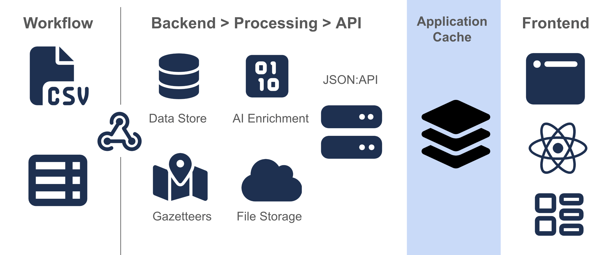
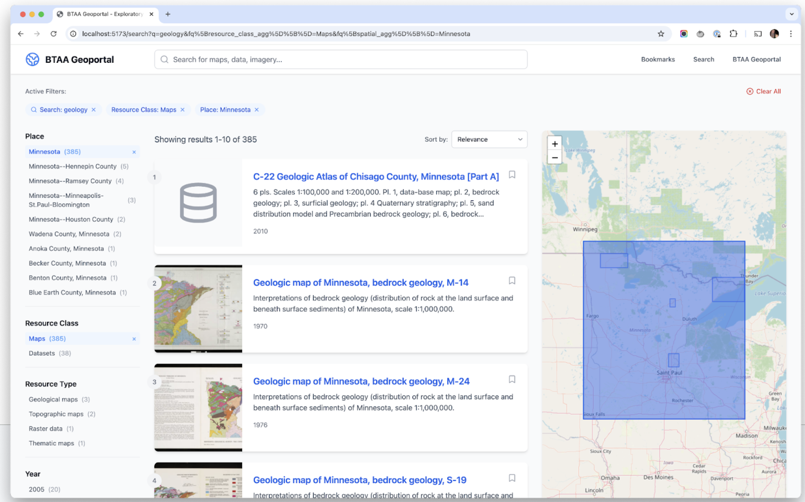
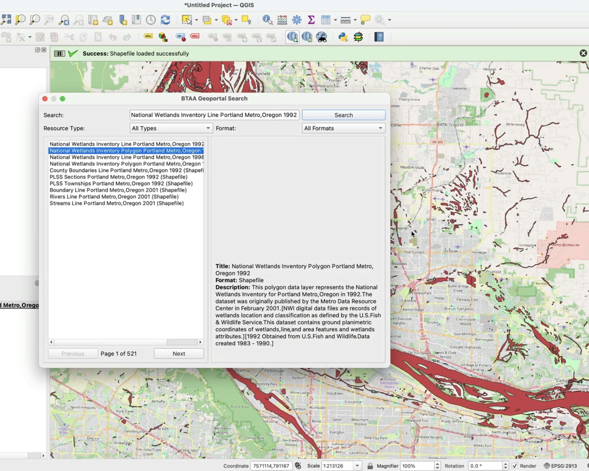
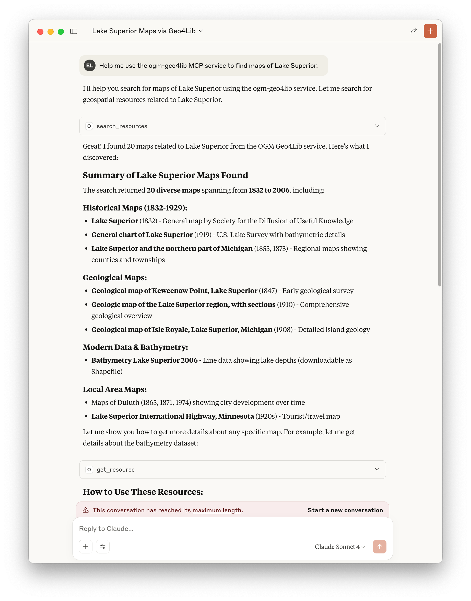

# BTAA Geospatial API & Linked Data



Welcome to the BTAA Geospatial API and linked data homepage. This comprehensive platform provides both a RESTful API for geospatial metadata discovery and a collection of linked data assets for the Big Ten Academic Alliance (BTAA) geospatial data infrastructure.

## Overview

The BTAA Geospatial API platform consists of two primary components: 1) the [**BTAA Geospatial API**](#btaa-geospatial-api) and 2) our [**Linked Data Assets**](#linked-data-assets)



### BTAA Geospatial API Presentation

Review a slide deck from the original presentation. [Google Slides - BTAA Geospatial API](https://docs.google.com/presentation/d/12hdRyqzwQKk2WJXBXg8soNNSMSWIYH3rSlx52X5XMro/edit?usp=sharing)

### **BTAA Geospatial API**
A read-only, OpenGeoMetadata API-compliant web service for programmatically accessing, searching, and retrieving metadata records that conform to the BTAA GIN's extended-OGM Aardvark schema.

[BTAA Geospatial API Documentation :octicons-arrow-right-24:](/api){ .md-button .md-button--primary }

#### Key Features

* **RESTful Design** - Predictable, cache-friendly URLs
* **OpenGeoMetadata API Compliance** - Built on open standards
* **Faceted Spatial Search** - Full-text, faceted geospatial discovery
* **Structured Metadata** - JSON-LD formatted responses
* **Client-Friendly** - Powers search interfaces and GIS applications

### **Linked Data Assets**
A collection of semantic web resources that provide standardized data models and schemas for BTAA geospatial metadata.

[Linked Data Asset Documentation :octicons-arrow-right-24:](/ld){ .md-button .md-button--primary }

**Available Assets:**

* **Contexts** - JSON-LD context files for data modeling
* **Profiles** - JSON-LD data profiles and specifications
* **Schemas** - JSON Schema definitions for validation

## Quick Start

### For API Users

1. **Read the [API Documentation](api/index.md)** - Complete specification and examples
2. **Check [Authentication](api/authentication.md)** - API key requirements
3. **Explore [Endpoints](api/requests.md)** - Available API operations
4. **Review [Rate Limits](api/rate_limiting.md)** - Usage guidelines

### For Linked Data Developers

1. **Browse [Linked Data Assets](linked-data/)** - Contexts, profiles, and schemas
2. **Check [Schemas](linked-data/schemas.md)** - JSON Schema validation
3. **Review [API Reference](linked-data/reference.md)** - Technical specifications
4. **Explore [Standards](api/standards.md)** - Compliance and interoperability

## Use Cases

<div class="grid" markdown>

<div class="cell" markdown>

### **Academic Libraries**
- Power geospatial discovery interfaces, like the BTAA Geoportal
- Integrate with existing library systems
- Provide standardized metadata access

### **Researchers**
- Automate metadata discovery workflows
- Access structured geospatial data
- Build reproducible research pipelines

</div>

<div class="cell" markdown>

### **Developers**
- Create GIS applications and plugins
- Build search and discovery tools
- Integrate with existing geospatial workflows

### **Data Providers**
- Standardized metadata formats
- Ensure interoperability
- Improve data discoverability

</div>

</div>

## Example API Integrations

### BTAA Geoportal (New React Frontend)
A prototype React frontend was created to display the feature parity of the new backend API with GeoBlacklight.



### QGIS Plugin
A prototype QGIS Plugin was developed to display the potential to reuse and integrate GeoBTAA data directly into the tools GIS researchers use on a daily basis.



### Claude Desktop (MCP Integration)
A proof-of-concept integration into Claude Desktop displays the potential for integrating GeoBTAA resources into cutting-edge AI/LLM research tools.



## Getting Started

### API Access

```bash
# Example API request
curl -H "Authorization: Bearer YOUR_API_KEY" \
     https://api.geobtaa.org/resources
```

## Support & Community

- **Contact Us**: [Feedback](https://geo.btaa.org/feedback)
- **Issues**: [GitHub Issues](https://github.com/geobtaa/ld/issues)
- **Discussions**: [GitHub Discussions](https://github.com/geobtaa/ld/discussions)
- **Documentation**: [API Reference](api/index.md)

---

*This project is part of the Big Ten Academic Alliance Geospatial Data Infrastructure.* 